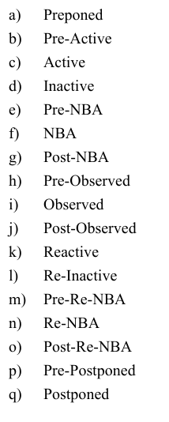

### Clock Blocking:
IEEE Standard: https://ieeexplore.ieee.org/stamp/stamp.jsp?tp=&arnumber=8299595&tag=1
- 14.3: " Unless otherwise specified, the default input skew is 1step and the default output skew is 0. A step is a
 special time unit whose value is defined in 3.14.3
 . A 1step input skew allows input signals to sample their
 steady-state values in the time step immediately before the clock event (i.e., in the preceding Postponed
 region)."
 - 3.14.3: STEP - gloabl time precision: minimym timeprecisison of all statements so literally last value executed

 - To avoid races, clocking block `outputs` with no skew are driven in the same time as thehir specified clocking even, in the Re-NBA region

 

 **Figure 1:** Clocking Block Info: Note that default input skew = 1step: Outputs with no specified output skew (or explicit #0 skew) will be driven at the same time as their specified clocking event, in the Re-NBA region
 - Note that clocking block outputs will be driven in the Re-NBA region AFTER the NBA region so if q is a clokcing block output and we do q <= d in simulation, the new value of q (whcih is d) is IMMEDIATELY propagated to the DUT!!

 